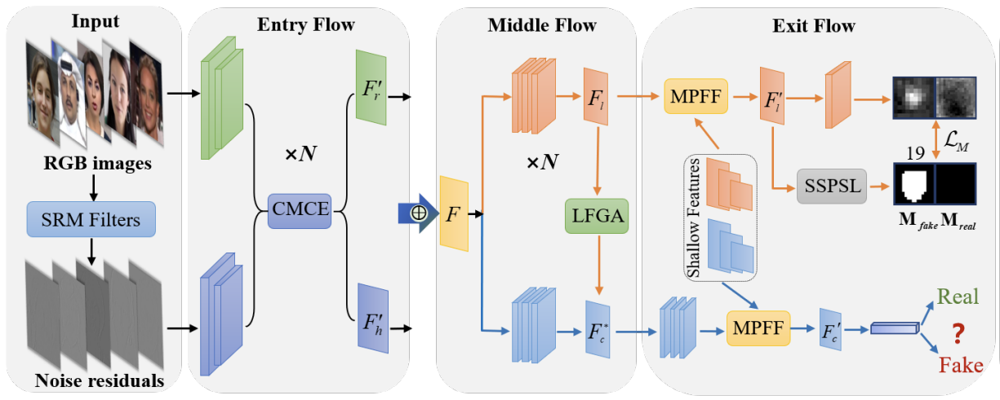

# Locate and Verify: A Two-Stream Network for Improved Deepfake Detection

[[Locate and Verify]](https://scholar.google.com/scholar?hl=zh-CN&as_sdt=0%2C5&q=Locate+and+Verify%3A+A+Two-Stream+Network+for+Improved+Deepfake+Detection&btnG=)

## Approach



## Dependencies
```
pip install requirement.txt
```

## Data Preparation
1. Download the dataset from [FF++](https://github.com/ondyari/FaceForensics).
2. Download the landmark detector from [here](https://github.com/codeniko/shape_predictor_81_face_landmarks).
3. Extract frames from FF++ videos.
4. Run the code in folder *./process* to get the aligned images and masks.

## Results

Our model achieved the following performance on:

| Training Data | Backbone        | FF++       | Celeb-DF   | DFDC_Pre       | DFD       |
| ------------- | --------------- | ---------- | ---------- | ---------- |---------- |
| FF++          | Xception       | 0.998     | 0.860     | 0.835     |0.955     |

Note: the metric is *frame-level AUC*.
## Training

To train our model from scratch, please run :

```
python3  train.py --opt ./config/FF++.yml --gpu *
or
python -m torch.distributed.launch --nproc_per_node * --nnode * train.py --opt ./config/FF++.yml
```

## Citation
```
@article{shuai2023locate,
  title={Locate and Verify: A Two-Stream Network for Improved Deepfake Detection},
  author={Shuai, Chao and Zhong, Jieming and Wu, Shuang and Lin, Feng and Wang, Zhibo and Ba, Zhongjie and Liu, Zhenguang and Cavallaro, Lorenzo and Ren, Kui},
  journal={arXiv preprint arXiv:2309.11131},
  year={2023}
}
```
